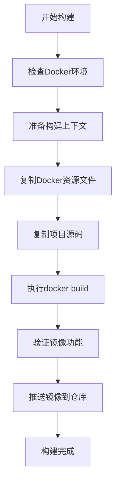

# 分布式PITest Maven插件

基于Kubernetes的分布式PITest (Pit Mutation Testing) Maven插件，支持Docker镜像自动构建和分布式执行。

## 📋 目录

- [功能特性](https://claude.ai/chat/857027af-bde7-4a7a-9ccf-ccd2c998c795#功能特性)
- [系统要求](https://claude.ai/chat/857027af-bde7-4a7a-9ccf-ccd2c998c795#系统要求)
- [快速开始](https://claude.ai/chat/857027af-bde7-4a7a-9ccf-ccd2c998c795#快速开始)
- [配置说明](https://claude.ai/chat/857027af-bde7-4a7a-9ccf-ccd2c998c795#配置说明)
- [使用场景](https://claude.ai/chat/857027af-bde7-4a7a-9ccf-ccd2c998c795#使用场景)
- [Docker集成](https://claude.ai/chat/857027af-bde7-4a7a-9ccf-ccd2c998c795#docker集成)
- [多模块项目](https://claude.ai/chat/857027af-bde7-4a7a-9ccf-ccd2c998c795#多模块项目)
- [CI/CD集成](https://claude.ai/chat/857027af-bde7-4a7a-9ccf-ccd2c998c795#cicd集成)
- [故障排除](https://claude.ai/chat/857027af-bde7-4a7a-9ccf-ccd2c998c795#故障排除)
- [开发指南](https://claude.ai/chat/857027af-bde7-4a7a-9ccf-ccd2c998c795#开发指南)

## 🚀 功能特性

### 核心功能

- **分布式执行**: 在Kubernetes集群中并行执行PITest突变测试
- **Docker集成**: 自动构建测试执行镜像，支持CI/CD环境
- **智能分区**: 支持包级别和自定义分区策略
- **结果聚合**: 自动聚合分布式执行结果，生成统一报告
- **多模块支持**: 完整的多模块Maven项目支持

### 增强特性

- **源码分析**: 集成AST分析，提供详细的变异代码对比
- **实时监控**: Pod执行状态实时监控和日志收集
- **资源管理**: 智能的Kubernetes资源管理和清理
- **缓存优化**: 镜像构建缓存，避免重复构建
- **报告增强**: 包含源码的详细HTML报告

## 📋 系统要求

### 基础环境

- **Java**: JDK 8 或更高版本
- **Maven**: 3.6.0 或更高版本
- **Kubernetes**: 1.16 或更高版本
- **Docker**: 19.03 或更高版本 (如果使用镜像构建功能)

### 权限要求

- Kubernetes集群访问权限
- Docker镜像构建和推送权限 (如果启用)
- kubectl命令行工具配置

## 🚀 快速开始

### 1. 基本配置

在项目的 `pom.xml` 中添加插件配置：

```xml
<plugin>
    <groupId>com.distributed.pitest</groupId>
    <artifactId>distributed-pitest-maven-plugin</artifactId>
    <version>1.0.0</version>
    <configuration>
        <!-- 基本配置 -->
        <targetClasses>com.example.*</targetClasses>
        <targetTests>com.example.*Test</targetTests>
        
        <!-- Kubernetes配置 -->
        <k8sNamespace>default</k8sNamespace>
        <maxParallelPods>5</maxParallelPods>
        
        <!-- Docker镜像配置 -->
        <buildDockerImage>true</buildDockerImage>
        <dockerRegistry>localhost:5000</dockerRegistry>
        <dockerImageName>my-pitest</dockerImageName>
        <dockerImageTag>${project.version}</dockerImageTag>
    </configuration>
</plugin>
```

### 2. 执行测试

```bash
# 执行分布式PITest（自动构建镜像）
mvn verify -P docker-build

# 或者直接调用插件
mvn com.distributed.pitest:distributed-pitest-maven-plugin:distributed-mutationCoverage
```

### 3. 查看结果

测试完成后，查看生成的报告：

- **HTML报告**: `target/pit-reports/html/index.html`
- **XML报告**: `target/pit-reports/mutations.xml`
- **摘要报告**: `target/pit-reports/summary.txt`

## ⚙️ 配置说明

### 基本参数

| 参数                | 默认值                                   | 说明                            |
| ------------------- | ---------------------------------------- | ------------------------------- |
| `targetClasses`     | -                                        | 目标测试类模式                  |
| `targetTests`       | -                                        | 目标测试类模式                  |
| `partitionStrategy` | `PACKAGE`                                | 分区策略 (`PACKAGE`, `DEFAULT`) |
| `outputDirectory`   | `${project.build.directory}/pit-reports` | 报告输出目录                    |

### Kubernetes配置

| 参数               | 默认值    | 说明               |
| ------------------ | --------- | ------------------ |
| `k8sNamespace`     | `default` | Kubernetes命名空间 |
| `maxParallelPods`  | `5`       | 最大并行Pod数量    |
| `kubeConfigPath`   | -         | kubeconfig文件路径 |
| `podMemoryLimit`   | `1Gi`     | Pod内存限制        |
| `podCpuLimit`      | `1`       | Pod CPU限制        |
| `timeoutInSeconds` | `1800`    | 执行超时时间（秒） |

### Docker镜像配置

| 参数                        | 默认值               | 说明                       |
| --------------------------- | -------------------- | -------------------------- |
| `buildDockerImage`          | `false`              | 是否构建Docker镜像         |
| `dockerRegistry`            | `localhost:5000`     | Docker镜像仓库地址         |
| `dockerImageName`           | `distributed-pitest` | 镜像名称                   |
| `dockerImageTag`            | `latest`             | 镜像标签                   |
| `pushDockerImage`           | `false`              | 是否推送镜像到仓库         |
| `useBuiltImage`             | `true`               | 是否使用构建的镜像执行测试 |
| `dockerBuildTimeoutMinutes` | `30`                 | 镜像构建超时时间（分钟）   |
| `forceImageRebuild`         | `false`              | 强制重新构建镜像           |

### PITest配置

| 参数              | 默认值                  | 说明         |
| ----------------- | ----------------------- | ------------ |
| `pitestVersion`   | `1.9.0`                 | PITest版本   |
| `baseImage`       | `maven:3.8.5-openjdk-8` | 基础执行镜像 |
| `imagePullPolicy` | `IfNotPresent`          | 镜像拉取策略 |

## 🎯 使用场景

### 场景1: 本地开发测试

```xml
<plugin>
    <groupId>com.distributed.pitest</groupId>
    <artifactId>distributed-pitest-maven-plugin</artifactId>
    <version>1.0.0</version>
    <configuration>
        <targetClasses>com.example.*</targetClasses>
        <targetTests>com.example.*Test</targetTests>
        <k8sNamespace>default</k8sNamespace>
        <maxParallelPods>3</maxParallelPods>
        <buildDockerImage>true</buildDockerImage>
        <pushDockerImage>false</pushDockerImage>
    </configuration>
</plugin>
mvn verify -P docker-build
```

### 场景2: CI/CD环境

```xml
<plugin>
    <groupId>com.distributed.pitest</groupId>
    <artifactId>distributed-pitest-maven-plugin</artifactId>
    <version>1.0.0</version>
    <configuration>
        <targetClasses>com.example.*</targetClasses>
        <targetTests>com.example.*Test</targetTests>
        <buildDockerImage>true</buildDockerImage>
        <dockerRegistry>${env.DOCKER_REGISTRY}</dockerRegistry>
        <dockerImageTag>${env.BUILD_NUMBER}</dockerRegistry>
        <pushDockerImage>true</pushDockerImage>
        <k8sNamespace>pitest-ci</k8sNamespace>
        <maxParallelPods>10</maxParallelPods>
    </configuration>
</plugin>
```

### 场景3: 使用现有镜像

```bash
mvn verify \
  -DbuildDockerImage=false \
  -DbaseImage=your-registry.com/pitest-runner:v1.0.0 \
  -DmaxParallelPods=8
```

## 🐳 Docker集成

### 自动镜像构建

插件会自动构建包含以下组件的Docker镜像：

- **基础环境**: OpenJDK 8 + Maven 3.8.5
- **PITest工具**: 预装PITest 1.9.0及相关依赖
- **执行脚本**: 自动化的测试执行和结果收集脚本
- **项目源码**: 可选的项目源码包含

### 镜像构建过程



### 构建输出示例

```
[INFO] Starting Docker image build process for project: my-project
[INFO] Preparing build context for project: my-project
[INFO] Copying Docker resource files to build directory
[INFO] Docker resource files copied successfully
[INFO] Executing: ./build-image.sh --registry localhost:5000 --name distributed-pitest --tag v1.0.0
[BUILD] Step 1/12 : FROM openjdk:8-jdk-slim
[BUILD] ---> 8c8f0f9d3f1d
[BUILD] Step 2/12 : WORKDIR /app
[BUILD] ---> Running in 2f3a4b5c6d7e
[BUILD] ---> 9e8f7a6b5c4d
[BUILD] Successfully built 9e8f7a6b5c4d
[BUILD] Successfully tagged localhost:5000/distributed-pitest:v1.0.0
[INFO] Docker image built successfully: localhost:5000/distributed-pitest:v1.0.0
```

## 📦 多模块项目

### 父项目配置

```xml
<!-- 父pom.xml -->
<project>
    <groupId>com.example</groupId>
    <artifactId>multi-module-parent</artifactId>
    <version>1.0.0</version>
    <packaging>pom</packaging>
    
    <modules>
        <module>module-a</module>
        <module>module-b</module>
        <module>module-c</module>
    </modules>
    
    <build>
        <pluginManagement>
            <plugins>
                <plugin>
                    <groupId>com.distributed.pitest</groupId>
                    <artifactId>distributed-pitest-maven-plugin</artifactId>
                    <version>1.0.0</version>
                    <configuration>
                        <buildDockerImage>true</buildDockerImage>
                        <dockerRegistry>${docker.registry}</dockerRegistry>
                        <k8sNamespace>pitest</k8sNamespace>
                        <maxParallelPods>5</maxParallelPods>
                    </configuration>
                </plugin>
            </plugins>
        </pluginManagement>
    </build>
    
    <properties>
        <docker.registry>your-registry.com</docker.registry>
    </properties>
</project>
```

### 子模块配置

```xml
<!-- 子模块pom.xml -->
<project>
    <parent>
        <groupId>com.example</groupId>
        <artifactId>multi-module-parent</artifactId>
        <version>1.0.0</version>
    </parent>
    
    <artifactId>module-a</artifactId>
    
    <build>
        <plugins>
            <plugin>
                <groupId>com.distributed.pitest</groupId>
                <artifactId>distributed-pitest-maven-plugin</artifactId>
                <configuration>
                    <targetClasses>com.example.modulea.*</targetClasses>
                    <targetTests>com.example.modulea.*Test</targetTests>
                </configuration>
            </plugin>
        </plugins>
    </build>
</project>
```

### 执行多模块测试

```bash
# 对所有模块执行分布式PITest
mvn verify -P docker-build

# 生成聚合报告
mvn com.distributed.pitest:distributed-pitest-maven-plugin:report-aggregate
```

### 聚合报告

多模块项目会自动生成聚合报告，包含：

- **整体统计**: 所有模块的汇总信息
- **模块对比**: 各模块的变异分数对比
- **依赖分析**: 模块间依赖关系分析
- **详细报告**: 每个模块的详细测试报告

## 🔧 CI/CD集成

### GitHub Actions

```yaml
name: Distributed PITest

on:
  push:
    branches: [ main, develop ]
  pull_request:
    branches: [ main ]

jobs:
  pitest:
    runs-on: ubuntu-latest
    
    steps:
    - uses: actions/checkout@v3
    
    - name: Set up JDK 8
      uses: actions/setup-java@v3
      with:
        java-version: '8'
        distribution: 'temurin'
    
    - name: Set up kubectl
      uses: azure/setup-kubectl@v3
      with:
        version: 'v1.24.0'
    
    - name: Configure Kubernetes
      run: |
        echo "${{ secrets.KUBE_CONFIG }}" | base64 -d > $HOME/.kube/config
    
    - name: Run Distributed PITest
      run: |
        mvn verify -P ci \
          -DdockerRegistry=${{ secrets.DOCKER_REGISTRY }} \
          -DdockerImageTag=${{ github.run_number }} \
          -DpushDockerImage=true
      env:
        CI: true
        BUILD_NUMBER: ${{ github.run_number }}
        DOCKER_REGISTRY: ${{ secrets.DOCKER_REGISTRY }}
    
    - name: Upload PITest Reports
      uses: actions/upload-artifact@v3
      if: always()
      with:
        name: pitest-reports
        path: |
          **/target/pit-reports/
          **/target/pit-reports-aggregate/
```

### Jenkins Pipeline

```groovy
pipeline {
    agent any
    
    environment {
        DOCKER_REGISTRY = credentials('docker-registry')
        KUBE_CONFIG = credentials('kube-config')
    }
    
    stages {
        stage('Checkout') {
            steps {
                checkout scm
            }
        }
        
        stage('Setup') {
            steps {
                sh 'echo "$KUBE_CONFIG" > $HOME/.kube/config'
            }
        }
        
        stage('Distributed PITest') {
            steps {
                sh '''
                    mvn verify -P ci \
                      -DdockerRegistry=${DOCKER_REGISTRY} \
                      -DdockerImageTag=${BUILD_NUMBER} \
                      -DpushDockerImage=true
                '''
            }
        }
        
        stage('Aggregate Report') {
            steps {
                sh 'mvn com.distributed.pitest:distributed-pitest-maven-plugin:report-aggregate'
            }
        }
    }
    
    post {
        always {
            publishHTML([
                allowMissing: false,
                alwaysLinkToLastBuild: true,
                keepAll: true,
                reportDir: 'target/pit-reports-aggregate/html',
                reportFiles: 'index.html',
                reportName: 'PITest Aggregate Report'
            ])
        }
    }
}
```

## 🔍 故障排除

### 常见问题

#### 1. Docker镜像构建失败

```bash
# 检查Docker是否运行
docker version

# 检查磁盘空间
df -h

# 查看详细构建日志
mvn verify -P docker-build -X
```

#### 2. Kubernetes连接问题

```bash
# 验证kubeconfig
kubectl config current-context

# 检查命名空间
kubectl get namespaces

# 验证权限
kubectl auth can-i create pods
```

#### 3. Pod执行超时

```xml
<configuration>
    <!-- 增加超时时间 -->
    <timeoutInSeconds>3600</timeoutInSeconds>
    <!-- 增加资源限制 -->
    <podMemoryLimit>2Gi</podMemoryLimit>
    <podCpuLimit>2</podCpuLimit>
</configuration>
```

#### 4. 镜像拉取失败

```bash
# 检查镜像是否存在
docker images | grep distributed-pitest

# 使用本地镜像
mvn verify -DuseBuiltImage=true -DimagePullPolicy=Never
```

### 调试模式

启用详细日志：

```bash
mvn verify -P docker-build -X -e
```

查看Pod日志：

```bash
kubectl logs -f -l app=pitest-executor -n your-namespace
```

### 性能调优

#### 优化并行度

```xml
<configuration>
    <!-- 根据集群资源调整 -->
    <maxParallelPods>10</maxParallelPods>
    <!-- 优化资源分配 -->
    <podMemoryLimit>1Gi</podMemoryLimit>
    <podCpuLimit>1</podCpuLimit>
</configuration>
```

#### 优化分区策略

```xml
<configuration>
    <!-- 包级别分区适合大项目 -->
    <partitionStrategy>PACKAGE</partitionStrategy>
    <!-- 默认分区适合小项目 -->
    <partitionStrategy>DEFAULT</partitionStrategy>
</configuration>
```

## 🛠️ 开发指南

### 项目结构

```
src/
├── main/
│   ├── java/
│   │   └── com/distributed/pitest/
│   │       ├── maven/                 # Maven插件实现
│   │       ├── kubernetes/            # Kubernetes执行器
│   │       ├── image/                 # Docker镜像构建
│   │       ├── service/               # 业务服务层
│   │       ├── model/                 # 数据模型
│   │       ├── partition/             # 分区策略
│   │       ├── result/                # 结果聚合
│   │       ├── report/                # 报告生成
│   │       └── util/                  # 工具类
│   └── resources/
│       └── docker/                    # Docker资源文件
│           ├── Dockerfile
│           ├── docker-compose.yml
│           ├── run-pitest.sh
│           ├── maven-settings.xml
│           └── build-image.sh
└── test/
    └── java/                          # 测试代码
```

### 核心组件

1. **DistributedPitestMojo**: Maven插件主入口
2. **ImageBuilder**: Docker镜像构建器
3. **KubernetesExecutor**: Kubernetes执行器
4. **ProjectPartitioner**: 项目分区器
5. **ResultAggregator**: 结果聚合器

### 扩展开发

#### 自定义分区策略

```java
public class CustomPartitioner implements ProjectPartitioner {
    @Override
    public List<TestPartition> partitionProject(MavenProject project, PitestConfiguration config) {
        // 实现自定义分区逻辑
        return partitions;
    }
}
```

#### 自定义报告生成器

```java
public class CustomReportGenerator implements ReportGenerator {
    @Override
    public void generateReport(AggregatedResult result, File outputDirectory) {
        // 实现自定义报告生成逻辑
    }
}
```

## 📄 许可证

本项目采用 MIT 许可证。详情请参阅 [LICENSE](https://claude.ai/chat/LICENSE) 文件。

## 🤝 贡献

欢迎提交 Issue 和 Pull Request！

### 开发环境设置

1. 克隆项目：

```bash
git clone https://github.com/your-org/distributed-pitest-maven-plugin.git
cd distributed-pitest-maven-plugin
```

1. 构建项目：

```bash
mvn clean install
```

1. 运行测试：

```bash
mvn test
```

### 提交规范

- 提交前请运行完整的测试套件
- 遵循项目的代码风格规范
- 提供清晰的提交消息和PR描述

## 📞 支持

如果您遇到问题或有疑问：

1. 查看 [故障排除](https://claude.ai/chat/857027af-bde7-4a7a-9ccf-ccd2c998c795#故障排除) 部分
2. 搜索现有的 [Issues](https://github.com/your-org/distributed-pitest-maven-plugin/issues)
3. 创建新的 Issue 详细描述问题
4. 联系维护团队获取支持

------

**分布式PITest Maven插件** - 让突变测试更快、更强、更智能！ 🚀